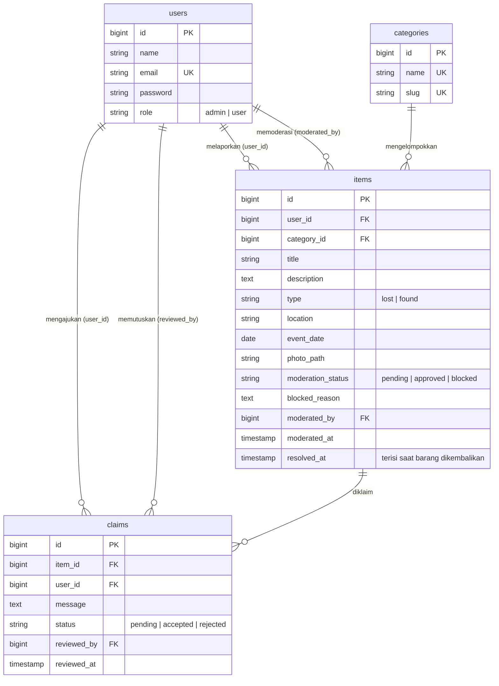
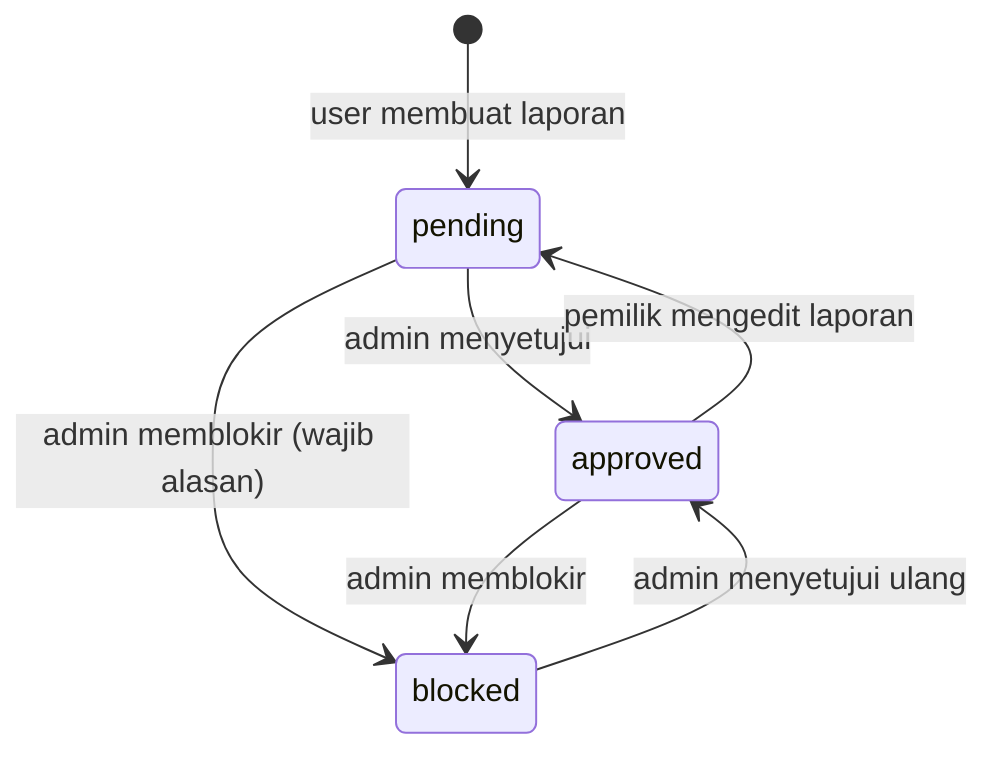
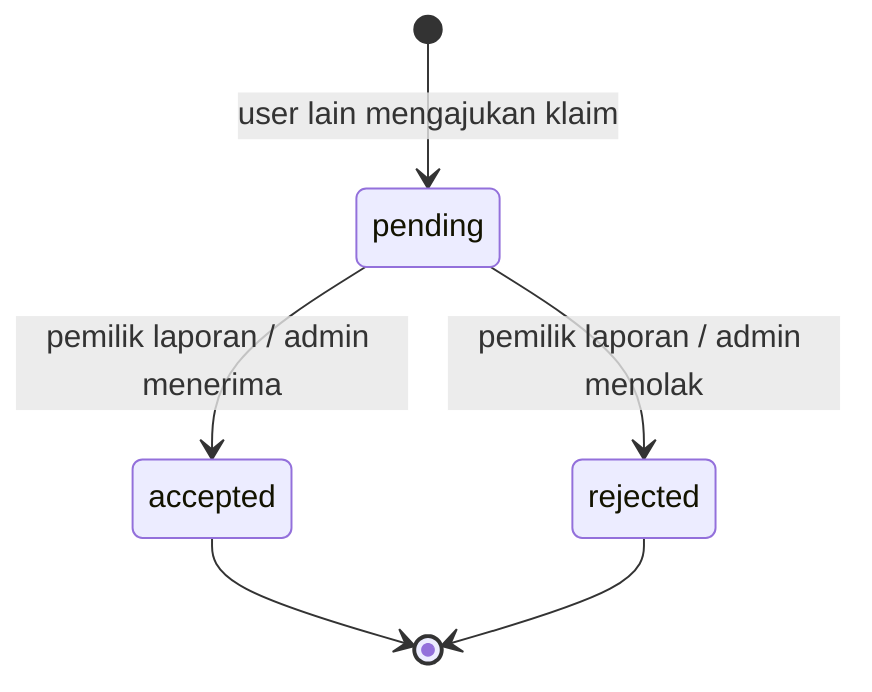

# Panduan Pengembangan — Lost Found (Backend)

Dokumen ini untuk anggota tim yang akan melanjutkan atau menambah fitur. Daftar endpoint ada di [`API.md`](API.md).

## Daftar isi

1. [Gambaran sistem](#1-gambaran-sistem)
2. [Setup lokal](#2-setup-lokal)
3. [Struktur folder & tanggung jawab tiap lapisan](#3-struktur-folder--tanggung-jawab-tiap-lapisan)
4. [Model data](#4-model-data)
5. [Alur bisnis](#5-alur-bisnis)
6. [Authentication & authorization](#6-authentication--authorization)
7. [Siklus sebuah request](#7-siklus-sebuah-request)
8. [Konvensi response & error](#8-konvensi-response--error)
9. [Resep: menambah fitur](#9-resep-menambah-fitur)
10. [Menghubungkan frontend Livewire](#10-menghubungkan-frontend-livewire)
11. [Testing](#11-testing)
12. [Troubleshooting](#12-troubleshooting)
13. [Checklist sebelum push](#13-checklist-sebelum-push)

---

## 1. Gambaran sistem

Lost Found adalah aplikasi pelaporan barang hilang dan ditemukan. Backend berupa **REST API** (Laravel 13, Eloquent, Sanctum, MariaDB/MySQL). Frontend (Livewire/Blade) hanya mengonsumsi API ini.

Peran pengguna:

| Role  | Bisa apa |
|-------|----------|
| Publik (tanpa login) | Melihat barang yang sudah disetujui, mencari/filter, melihat kategori |
| `user` | Semua hak publik + membuat/mengubah/menghapus laporan sendiri, mengklaim barang orang lain, memutuskan klaim atas laporannya |
| `admin` | Semua hak user + moderasi laporan, CRUD semua laporan, CRUD pengguna, CRUD kategori, memutuskan klaim apa pun |

## 2. Setup lokal

```bash
git clone <url-repo> && cd laravel-pemweb2-praktikum
composer install
cp .env.example .env
php artisan key:generate
```

Atur database di `.env` (buat dulu databasenya):

```
DB_CONNECTION=mariadb
DB_HOST=127.0.0.1
DB_PORT=3306
DB_DATABASE=lost_found
DB_USERNAME=root
DB_PASSWORD=
```

Lanjutkan:

```bash
php artisan migrate:fresh --seed
php artisan storage:link        # wajib agar foto bisa diakses lewat URL
php artisan serve
```

Akun hasil seed (password semuanya `password`):

| Email | Role |
|-------|------|
| admin@lostfound.test | admin |
| user@lostfound.test (Budi) | user |
| siti@lostfound.test | user |
| rina@lostfound.test | user |

Data seed: 7 kategori, 12 laporan approved, 5 pending, 2 blocked, 3 resolved, plus beberapa klaim.

## 3. Struktur folder & tanggung jawab tiap lapisan

```
app/
├── Enums/                 Nilai tetap: UserRole, ItemType, ModerationStatus, ClaimStatus
├── Http/
│   ├── Controllers/Api/
│   │   ├── AuthController.php        register, login, logout, me
│   │   ├── CategoryController.php    index (publik) + store/update/destroy (admin)
│   │   ├── ItemController.php        sisi publik & pengguna
│   │   ├── ClaimController.php       ajukan & putuskan klaim
│   │   └── Admin/
│   │       ├── ItemController.php    CRUD + moderasi semua laporan
│   │       └── UserController.php    CRUD pengguna
│   ├── Requests/          Validasi input (Form Request), dikelompokkan per fitur
│   └── Resources/         Bentuk JSON yang keluar (API Resource)
├── Models/                User, Category, Item, Claim (relasi, cast, scope)
├── Policies/              Aturan "siapa boleh apa" atas sebuah data
└── Services/
    └── ItemPhotoService.php   Simpan/hapus/URL foto
bootstrap/app.php          Routing API, alias middleware Sanctum, format error JSON
routes/api.php             Semua endpoint
database/                  migrations, factories, seeders
docs/                      API.md (daftar endpoint), DEVELOPMENT.md (dokumen ini)
```

Aturan pembagian tugas, supaya kode tetap rapi:

| Lapisan | Boleh | Jangan |
|---------|-------|--------|
| **Route** | Memetakan URL → controller, memasang middleware (`auth:sanctum`, `abilities:...`) | Menaruh logika |
| **Form Request** | Validasi input | Query database, otorisasi kepemilikan |
| **Controller** | Mengalirkan: validasi → otorisasi (`Gate::authorize`) → aksi → resource | Menulis query filter panjang, mengembalikan model mentah |
| **Policy** | Aturan kepemilikan/role atas satu data | Membaca request |
| **Model** | Relasi, cast, scope (`approved`, `filter`), helper (`isResolved`) | Logika HTTP |
| **Resource** | Menentukan field yang keluar & menyembunyikan field sensitif | Query |
| **Service** | Pekerjaan yang dipakai berulang (mis. file foto) | Logika bisnis yang spesifik satu endpoint |

## 4. Model data



Perilaku penghapusan (foreign key):

| Relasi | Saat induk dihapus |
|--------|--------------------|
| `items.user_id`, `claims.user_id`, `claims.item_id` | ikut terhapus (cascade) |
| `items.category_id` | **ditolak** (restrict) → API mengembalikan 409 |
| `items.moderated_by`, `claims.reviewed_by` | diisi `NULL` |

Kolom enum disimpan sebagai **string biasa** di database dan di-cast ke enum PHP di model. Contoh: `$item->type` bertipe `ItemType`, bukan string. Bandingkan dengan `ModerationStatus::Approved`, jangan dengan `'approved'`.

## 5. Alur bisnis

**Moderasi laporan**



- Hanya `approved` yang tampil di beranda publik. `pending` dan `blocked` hanya terlihat oleh pemilik dan admin.
- Pemilik tidak bisa mengedit laporan yang `blocked` atau sudah `resolved`.
- Laporan yang dibuat **admin** langsung `approved`.

**Klaim**



Saat sebuah klaim **diterima** (dalam satu transaksi database):
1. `claims.status` → `accepted`
2. `items.resolved_at` diisi
3. Semua klaim `pending` lain pada barang itu → `rejected`

Aturan pengajuan klaim:

| Kondisi | Respon |
|---------|--------|
| Klaim laporan sendiri | 403 |
| Barang belum `approved` | 404 |
| Barang sudah `resolved` | 409 |
| Sudah punya klaim `pending` di barang yang sama | 409 |
| Memutuskan klaim yang sudah diproses | 409 |

## 6. Authentication & authorization

Ada **tiga lapis** penjagaan. Memahami urutannya penting saat men-debug 401/403.

```
Request → auth:sanctum → abilities:<role> → Form Request → Gate::authorize (Policy) → aksi
            (401)            (403)            (422)             (403)
```

1. **`auth:sanctum`** — token Bearer valid? Jika tidak → 401.
2. **`abilities:user` / `abilities:admin`** — token membawa ability yang cukup? Jika tidak → 403. Ability ditentukan saat login oleh `User::tokenAbilities()`:
   - user biasa: `['user']`
   - admin: `['user', 'admin']`
3. **Policy** — aturan atas data tertentu (kepemilikan). Contoh: hanya pemilik atau admin yang boleh mengubah sebuah laporan.

Ringkasan Policy:

| Policy::method | Lolos jika |
|----------------|------------|
| `ItemPolicy::update` | admin, atau pemilik **dan** belum resolved **dan** tidak blocked |
| `ItemPolicy::delete` | admin, atau pemilik dan belum resolved |
| `ItemPolicy::claim` | bukan pemilik laporan |
| `ItemPolicy::viewClaims` | admin atau pemilik laporan |
| `ClaimPolicy::review` | admin atau pemilik laporan yang diklaim |

Catatan penting:

- **Role tidak pernah diambil dari input publik.** `AuthController::register` selalu mengisi `UserRole::User`.
- Token menyimpan ability **saat dibuat**. Karena itu, saat admin mengubah **role** atau **password** seorang user, semua token user itu dihapus (`UserController::update`) supaya ia login ulang dengan ability baru.
- Login dibatasi 10 percobaan per menit (`throttle:10,1`).
- Admin tidak bisa menghapus atau mengubah role akunnya sendiri (mencegah sistem tanpa admin).
- Untuk memeriksa otorisasi di controller pakai `Gate::authorize('update', $item)`. Controller dasar Laravel 13 tidak punya `$this->authorize()`.

## 7. Siklus sebuah request

Contoh: `POST /api/items` (user membuat laporan).

```
routes/api.php
  └─ middleware: auth:sanctum, abilities:user
     └─ ItemController@store(StoreItemRequest $request, ItemPhotoService $photos)
        ├─ StoreItemRequest   → validasi (gagal → 422, controller tidak dijalankan)
        ├─ ItemPhotoService   → simpan foto ke disk "public" folder items/
        ├─ $user->items()->create([... moderation_status = Pending])
        └─ ItemResource       → JSON; dibungkus {"data": ...}; status 201
```

Untuk daftar (`GET /api/items`):

```
ItemFilterRequest (validasi query) → Item::approved() → ->filter($request->filters())
→ ->paginate($request->perPage()) → ItemResource::collection → { data, links, meta }
```

Filter yang didukung (`Item::scopeFilter`): `search`, `type`, `category_id`, `moderation_status`, `user_id`, `resolved`, `date_from`, `date_to`. Scope `approved()` membatasi ke laporan yang disetujui dan dipakai di endpoint publik. Endpoint admin tidak memakainya.

## 8. Konvensi response & error

**Sukses**

| Jenis | Bentuk | Status |
|-------|--------|--------|
| Satu data | `{ "data": { ... } }` | 200 / 201 |
| Daftar | `{ "data": [...], "links": {...}, "meta": {...} }` | 200 |
| Hapus | tanpa body | 204 |
| Aksi sederhana | `{ "message": "..." }` | 200 |

**Error — selalu satu bentuk**

```json
{ "message": "Data yang dikirim tidak valid.", "errors": { "title": ["The title field is required."] } }
```

`errors` berisi `null` untuk error non-validasi. Format ini dibuat di `bootstrap/app.php`:

| Exception | Status |
|-----------|--------|
| `ValidationException` | 422 |
| `AuthenticationException` | 401 |
| `AccessDeniedHttpException` / `MissingAbilityException` | 403 |
| `NotFoundHttpException` (termasuk model tidak ketemu) | 404 |
| `abort(409, '...')`, throttle 429, dll. | sesuai status, `message` dari exception |

Untuk melempar error bisnis dari controller cukup: `abort(409, 'Pesan yang ditampilkan ke pengguna.');`

**Aturan Resource:** jangan pernah `return $model;` langsung. Selalu lewat Resource supaya field sensitif tidak bocor. Contoh: `blocked_reason` hanya muncul untuk pemilik dan admin (lihat `ItemResource`).

## 9. Resep: menambah fitur

### 9.1 Menambah endpoint baru

Checklist berurutan:

1. **Route** di `routes/api.php`, tempatkan di grup yang sesuai (publik / `abilities:user` / `admin`). Pakai kata benda jamak dan method HTTP yang tepat. Hindari `/getData`, `/addItem`.
2. **Form Request**: `php artisan make:request Folder/NamaRequest`, isi `rules()`. Biarkan `authorize()` mengembalikan `true`; otorisasi lewat Policy.
3. **Controller**: validasi lewat type-hint Request, otorisasi dengan `Gate::authorize(...)`, lalu aksi.
4. **Resource**: kembalikan lewat Resource. Untuk daftar pakai `paginate()`.
5. **Policy**: tambah method di `ItemPolicy` / `ClaimPolicy` bila ada aturan kepemilikan baru.
6. **Dokumentasi**: tambah baris di `docs/API.md`.
7. **Postman**: tambah request + test di collection.

### 9.2 Menambah kolom pada laporan (contoh: `contact_phone`)

```bash
php artisan make:migration add_contact_phone_to_items_table --table=items
```

Isi `up()`:
```php
$table->string('contact_phone', 20)->nullable()->after('location');
```

Lalu ubah, semuanya wajib agar kolom benar-benar berfungsi:

| File | Perubahan |
|------|-----------|
| `Models/Item.php` | tambahkan `'contact_phone'` ke atribut `#[Fillable([...])]` |
| `Requests/Item/StoreItemRequest.php` | aturan: `'contact_phone' => ['nullable', 'string', 'max:20']` |
| `Requests/Item/UpdateItemRequest.php` | aturan yang sama dengan awalan `'sometimes'` |
| `Resources/ItemResource.php` | tambahkan `'contact_phone' => $this->contact_phone` (atau sembunyikan dari publik pakai `$this->when(...)`) |
| `database/factories/ItemFactory.php` | isi nilai contoh |
| `docs/API.md` | tambahkan field di daftar |

Gejala umum kalau ada yang terlewat: kolom tersimpan `NULL` padahal dikirim (lupa `Fillable` atau Form Request), atau tersimpan tapi tidak muncul di response (lupa Resource).

### 9.3 Menambah nilai pada enum (contoh: status klaim `cancelled`)

1. Tambah `case Cancelled = 'cancelled';` di `app/Enums/ClaimStatus.php`.
2. Tidak perlu migration (kolom berupa string).
3. Perbarui aturan validasi yang membatasi nilai (mis. `Rule::in([...])` di `ReviewClaimRequest`) dan logika di controller yang memakainya.
4. Cek semua `match` / `if` yang membandingkan enum itu.

### 9.4 Menambah entitas baru

```bash
php artisan make:model Nama -mf
```
Buat Policy (`make:policy NamaPolicy --model=Nama`), Form Request, Resource, controller, route, seeder/factory. Ikuti pola `Claim` sebagai contoh paling lengkap (relasi, status, policy, resource).

### 9.5 Filter/search baru pada daftar laporan

Tambah aturan di `ItemFilterRequest::rules()`, lalu tambah satu `->when(...)` di `Item::scopeFilter()`. Semua endpoint daftar (publik, `my/items`, admin) langsung ikut.

## 10. Menghubungkan frontend Livewire

> Bagian ini panduan rancangan. Frontend belum dibuat.

Aturan utama tugas: **backend wajib REST API**. Maka komponen Livewire sebaiknya memanggil API, bukan mengakses Eloquent langsung.

**Pola yang disarankan**

1. Saat login, komponen memanggil `POST /api/auth/login`, lalu menyimpan `data.token` di **session** server (jangan di localStorage).
2. Setiap aksi memakai token itu:

```php
use Illuminate\Support\Facades\Http;

$response = Http::acceptJson()
    ->withToken(session('api_token'))
    ->get(url('/api/my/items'), ['per_page' => 10]);

if ($response->failed()) {
    // $response->status() = 401/403/404/409/422
    // $response->json('message') dan $response->json('errors') siap ditampilkan
}
$items = $response->json('data');
```

3. Upload foto: `Http::attach('photo', file_get_contents($path), 'foto.jpg')->post(...)`.
4. Tampilkan `errors` per field di form dan `message` sebagai notifikasi sukses/gagal. Ini memenuhi syarat "feedback error/success" di soal.

**Perhatian**

- Memanggil API milik aplikasi sendiri lewat `url('/api/...')` bisa **macet (deadlock)** pada `php artisan serve` karena server lokal hanya melayani satu request sekaligus. Jalankan dengan beberapa worker: `PHP_CLI_SERVER_WORKERS=4 php artisan serve`.
- Alternatif tanpa masalah itu: panggil API dari browser memakai `fetch()` (mis. lewat Alpine.js) dengan token yang disimpan di session. Pilih satu pendekatan dan konsisten.
- Jika token kedaluwarsa atau dicabut (401), arahkan pengguna ke halaman login.

**Halaman dan endpoint yang dipakai**

| Halaman | Endpoint |
|---------|----------|
| Beranda | `GET /api/items`, `GET /api/categories` (filter & pencarian) |
| Detail barang + klaim | `GET /api/items/{id}`, `POST /api/items/{id}/claims` |
| Form lapor | `POST /api/items` (multipart), `GET /api/categories` |
| Laporan & klaim saya | `GET /api/my/items`, `GET /api/my/claims`, `PATCH /api/claims/{id}` |
| Admin: moderasi | `GET /api/admin/items?moderation_status=pending`, `PATCH /api/admin/items/{id}/moderation` |
| Admin: kelola | `/api/admin/items`, `/api/admin/users`, `/api/admin/categories` |

## 11. Testing

**Manual / API:** impor `LostFound.postman_collection.json` ke Postman, jalankan Collection Runner setelah `php artisan migrate:fresh --seed`. Pilih file foto sekali pada dua request yang butuh upload.

**Otomatis (Pest):** proyek sudah memuat Pest. Tes baru ditaruh di `tests/Feature/`.

```bash
php artisan make:test --pest ItemApiTest
php artisan test
```

Kerangka tes yang berguna (pakai factory dan `Sanctum::actingAs`):

```php
use App\Models\{Item, User};
use Laravel\Sanctum\Sanctum;

it('menolak user biasa mengakses endpoint admin', function () {
    Sanctum::actingAs(User::factory()->create(), ['user']);

    $this->getJson('/api/admin/items')->assertForbidden();
});

it('hanya menampilkan laporan approved di beranda', function () {
    Item::factory()->approved()->create();
    Item::factory()->pending()->create();

    $this->getJson('/api/items')->assertOk()->assertJsonCount(1, 'data');
});
```

State factory yang tersedia: `Item::factory()->pending()|approved()|blocked()|resolved()`, `Claim::factory()->accepted()|rejected()`, `User::factory()->admin()`.

> `Sanctum::actingAs($user, ['admin'])` — sertakan ability yang sesuai, karena middleware `abilities:` ikut diperiksa.

## 12. Troubleshooting

| Gejala | Penyebab & solusi |
|--------|-------------------|
| `vendor/autoload.php` tidak ditemukan | Belum `composer install` |
| `Class "App\Enums\..." not found` | File enum kosong / salah folder / salah namespace. Cek `ls app/Enums`, lalu `composer dump-autoload` |
| `Cannot redeclare class ...` atau peringatan *psr-4* | Isi dua file tertukar atau namespace tidak cocok dengan folder. Namespace harus sama dengan path-nya |
| Garis merah Intelephense tapi `php artisan` normal | Biasanya cache editor atau false positive tipe. Reload window VS Code |
| 401 padahal sudah login | Header `Authorization: Bearer <token>` tidak ada, atau lupa `Accept: application/json` |
| 403 di endpoint admin | Token milik user biasa. Login ulang sebagai admin. Jika role baru diubah, token lama sudah dicabut |
| Foto `photo_url` 404 | Belum `php artisan storage:link` |
| Update laporan + foto tidak membaca file | PHP tidak mem-parsing multipart pada PUT. Kirim **POST** dengan field `_method=PUT` |
| Kolom tersimpan `NULL` | Kolom belum masuk `#[Fillable]` atau aturan Form Request |
| Data tersimpan tapi tidak muncul di JSON | Field belum ditambahkan di Resource |
| Error 500 `SQLSTATE` saat migrate | Cek urutan timestamp migration: `categories` → `items` → `claims`; dan kredensial `.env` |
| Seeder gagal setelah mengubah kolom | Perbarui factory juga, lalu `php artisan migrate:fresh --seed` |
| `php artisan serve` terasa macet saat Livewire memanggil API sendiri | Lihat bagian 10: pakai `PHP_CLI_SERVER_WORKERS=4` |

Untuk melihat error 500 sebenarnya: `storage/logs/laravel.log`, atau `php artisan pail` untuk log langsung. Pastikan `APP_DEBUG=true` di lingkungan lokal saja.

## 13. Checklist sebelum push

```bash
composer lint              # rapikan gaya kode (Pint)
php artisan test           # tes otomatis
php artisan route:list     # pastikan route terdaftar tanpa error
```

- [ ] `migrate:fresh --seed` jalan bersih
- [ ] Collection Postman lolos semua
- [ ] Tidak ada `dd()`, `dump()`, atau `Log::` sisa debug
- [ ] `.env` **tidak** ikut ter-commit
- [ ] Endpoint baru sudah masuk `docs/API.md`
- [ ] Setiap controller hanya mengembalikan lewat Resource
- [ ] Setiap endpoint yang mengubah data sudah memakai middleware dan Policy yang tepat
- [ ] Pesan commit jelas, mis. `feat(claims): tolak klaim otomatis saat satu klaim diterima`
